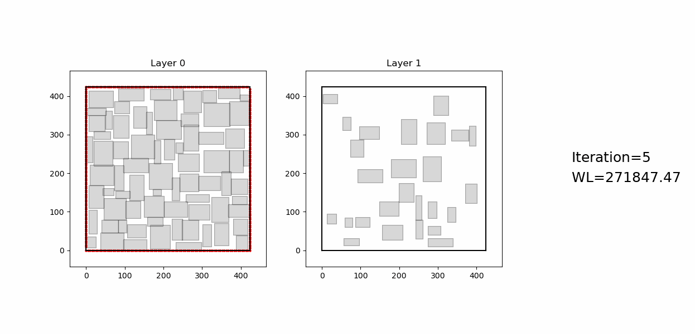
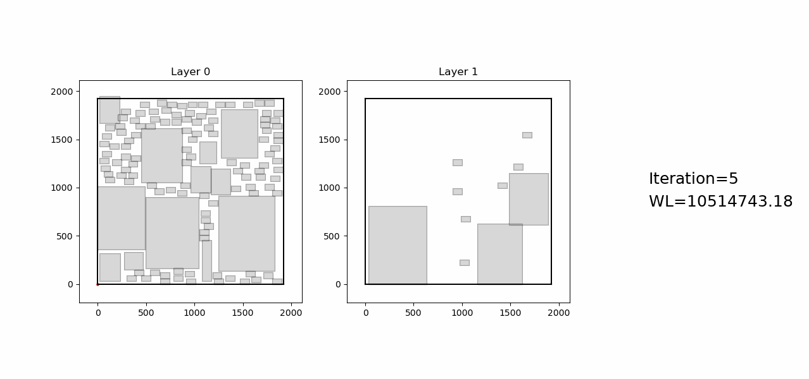

# Reinforcement Learning-based 3D Floorplanner with Die Swapping Mechanism

# Intro
3DICs offer significant advantages in performance, power and area over their 2D designs but introduce floorplanning challenges requiring the co-optimization of block positions and die assignments. While reinforcement learning (RL) has shown promising performance in 2D floorplanning, existing RL-based 3D methods rely on static and pre-assigned die placements, preventing true simultaneous optimization. To overcome this, we propose a novel RL-based 3D floorplanner that features a die-swapping mechanism, enabling the dynamic co-optimization of block placement and die assignment in RL-based approach for the first time. We develop an efficient spatial checking algorithm for available space checks in large layouts to support the die-swapping mechanism. Evaluation on the GSRC benchmark and a new benchmark generated by the OpenROAD suite demonstrates that our approach outperforms existing methods by significantly reducing cross-die wirelength, showcasing the critical importance of joint optimization and strong potential of RL for 3D physical design.

<p align="center">
  
</p>

<p align="center">
  
</p>


# Requirements
```bash
conda create -n flexplanner python=3.10
conda activate flexplanner
# CUDA 11.6
conda install pytorch==1.12.1 torchvision==0.13.1 cudatoolkit=11.6 -c pytorch -c conda-forge
# CUDA 11.3
conda install pytorch==1.12.1 torchvision==0.13.1 cudatoolkit=11.3 -c pytorch
# tensorboard and tensorboard-data-server
conda install tensorboard==2.17.0
pip install -r requirements.txt
```

# Run
If you want to run the case in GSRC
~~~
bash script/run_GSRC.sh
~~~

If you want to run the case in OpenROAD ([link](https://drive.google.com/drive/folders/1uyz2zquupWmWXOxJYuMvDn52754ad_Bf?usp=drive_link))
~~~
bash script/run_openroad.sh
~~~

# References
If you would like to use our RL-based 3D floorplanner with die swapping, please cite our published ISEDA paper as:
~~~
@inproceedings{luo2026reinforcement,
  author    = {Luo, Qin and Li, Hailiang and Young, Evangeline F. Y.},
  title     = {Reinforcement Learning-based 3D Floorplanner with Die Swapping Mechanism},
  booktitle = {International Symposium of EDA (ISEDA)},
  year      = {2026}
}
~~~
